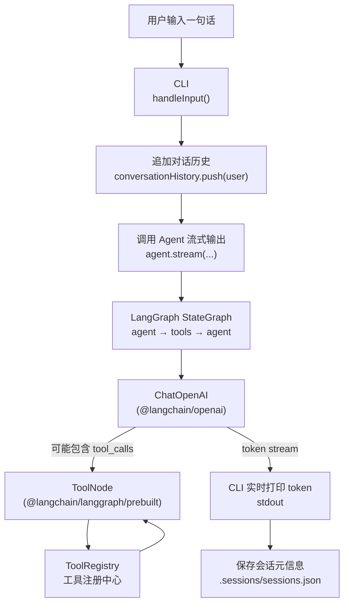
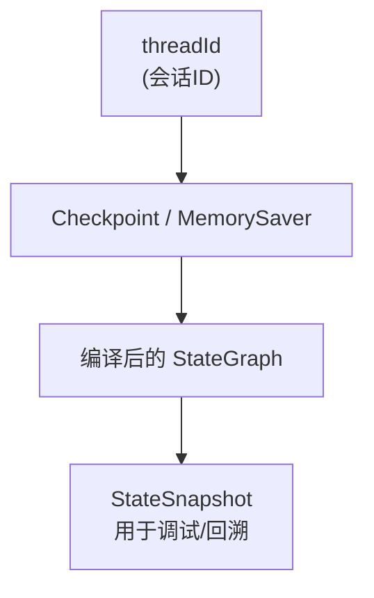
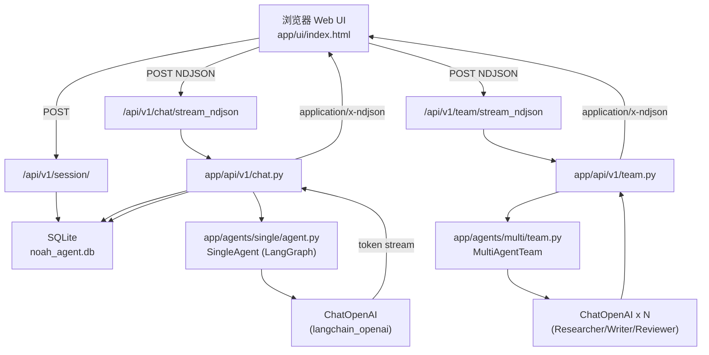

# Phase 1–3 流程图（含代码定位）

本文件给小白提供一个“从输入到输出”的端到端视角：你在 CLI/Web UI 输入一句话后，数据如何在前后端流动、在哪里落库、在哪里调用大模型/工具，以及每一步对应到哪个文件。

***

## Phase 1：CLI 单 Agent（Tool Calling + 流式输出）

**步骤 → 可点击代码定位（带行号）**

-  
  1. 读取用户输入与分发： [handleInput](file:///Users/noahadmin/noah/my-agent-cli/src/cli.ts#L412-L664)
-  
  1. 追加 user 消息到历史： [cli.ts:L610-L613](file:///Users/noahadmin/noah/my-agent-cli/src/cli.ts#L610-L613)
-  
  1. 调用单 Agent 流式输出： [cli.ts:L619-L649](file:///Users/noahadmin/noah/my-agent-cli/src/cli.ts#L619-L649)

 

Agent 内部按事件 yield（text/tool\_calls/tool\_result/done）： [LangGraphAgent.stream](file:///Users/noahadmin/noah/my-agent-cli/src/agent/agent.ts#L310-L368)

-  
  1. 构建“agent → tools → agent”的状态图： [buildGraph](file:///Users/noahadmin/noah/my-agent-cli/src/agent/agent.ts#L152-L257)
-  
  1. 工具注册中心（按名字取工具/全部工具）： [ToolRegistry](file:///Users/noahadmin/noah/my-agent-cli/src/tools/index.ts#L159-L205)
-  
  1. 示例工具定义（天气/搜索/计算）： [tools/index.ts:L31-L142](file:///Users/noahadmin/noah/my-agent-cli/src/tools/index.ts#L31-L142)
-  
  1. 会话保存到本地文件： [saveSession](file:///Users/noahadmin/noah/my-agent-cli/src/cli.ts#L125-L158)

***

## Phase 2：LangGraph 工作流能力（Checkpoint / 多会话 / 中断点 / 子图）

Phase 2 的“流程”还是 Phase 1 那条主线，只是把 Agent 的内部工程化做扎实：

- **Checkpoint**：同一个 `threadId` 可以恢复对话状态
- **Memory/Window/Summary**：对长对话做摘要/压缩
- **Interrupt**：中间节点允许人工确认（适合审批型任务）
- **Subgraph**：把复杂工作流拆分为可复用子图

**步骤 → 可点击代码定位（带行号）**

-  
  1. Checkpointer（MemorySaver）创建： [agent.ts:L34-L43](file:///Users/noahadmin/noah/my-agent-cli/src/agent/agent.ts#L34-L43)
-  
  1. 编译图时启用 checkpointer： [agent.ts:L254-L257](file:///Users/noahadmin/noah/my-agent-cli/src/agent/agent.ts#L254-L257)
-  
  1. 用 threadId 恢复/隔离会话： [agent.ts:L316-L320](file:///Users/noahadmin/noah/my-agent-cli/src/agent/agent.ts#L316-L320)
-  
  1. 读取会话历史（基于 StateSnapshot）： [getSessionHistory](file:///Users/noahadmin/noah/my-agent-cli/src/agent/agent.ts#L375-L419)
-  
  1. 记忆策略（Window/Summary/Entity）： [MemoryManager.process](file:///Users/noahadmin/noah/my-agent-cli/src/agent/memory.ts#L218-L260)
-  
  1. 中断点与恢复命令（approve/Command.resume）： [InterruptManager + helpers](file:///Users/noahadmin/noah/my-agent-cli/src/agent/interrupt.ts#L64-L193)
-  
  1. 子图（Research/Writing）以及主图编排： [createMainGraph](file:///Users/noahadmin/noah/my-agent-cli/src/agent/subgraph.ts#L205-L249)

***

## Phase 3：Python 后端 + Web UI（FastAPI + DB + SSE/NDJSON 流式）

你在浏览器打开 `/ui` 后，前端会先创建 Session，再调用单 Agent 或多 Agent 的接口。

### 为什么 Web UI 默认用 NDJSON，而不是直接用 SSE？

- SSE 标准是 `text/event-stream`，在某些 Electron/内嵌浏览器环境里用 `fetch()` 读取 SSE 可能会出现 `net::ERR_ABORTED`（请求被浏览器侧中止）。
- NDJSON 是“每行一个 JSON”，依然可以流式读，但更通用，便于用 `fetch().body.getReader()` 解析。

**步骤 → 可点击代码定位（带行号）**

-  
  1. 打开 `/ui` 静态页入口： [main.py:L49-L54](file:///Users/noahadmin/noah/my-agent-cli/phase3-backend/app/main.py#L49-L54)
-  
  1. Web UI 创建 Session（POST `/api/v1/session/`）： [createSession](file:///Users/noahadmin/noah/my-agent-cli/phase3-backend/app/ui/index.html#L394-L404)
-  
  1. Web UI 读取 NDJSON 流（按行解析 JSON）： [streamNDJSON](file:///Users/noahadmin/noah/my-agent-cli/phase3-backend/app/ui/index.html#L500-L542)
-  
  1. Web UI 点击“发送（流式）”触发请求： [sendBtn handler](file:///Users/noahadmin/noah/my-agent-cli/phase3-backend/app/ui/index.html#L607-L659)
-  
  1. Session API 创建会话并落库： [create\_session](file:///Users/noahadmin/noah/my-agent-cli/phase3-backend/app/api/v1/session.py#L17-L25)
-  
  1. 单 Agent NDJSON 流式接口（写入 user/assistant 到 DB）： [chat\_stream\_ndjson](file:///Users/noahadmin/noah/my-agent-cli/phase3-backend/app/api/v1/chat.py#L136-L183)
-  
  1. 单 Agent 图与事件映射（text/tool\_start/tool\_end）： [SingleAgent.stream](file:///Users/noahadmin/noah/my-agent-cli/phase3-backend/app/agents/single/agent.py#L15-L83)
-  
  1. Multi-Agent NDJSON 流式接口： [team\_stream\_ndjson](file:///Users/noahadmin/noah/my-agent-cli/phase3-backend/app/api/v1/team.py#L110-L147)
-  
  1. Multi-Agent 协作模式实现（Sequential/Parallel/Supervisor）： [MultiAgentTeam](file:///Users/noahadmin/noah/my-agent-cli/phase3-backend/app/agents/multi/team.py#L49-L120)
-  
  1. 后端配置加载（支持根目录 `.env.dev`）： [Settings.Config.env\_file](file:///Users/noahadmin/noah/my-agent-cli/phase3-backend/app/core/config.py#L8-L55)
-  
  1. FastAPI 依赖注入提供 DB Session： [get\_db](file:///Users/noahadmin/noah/my-agent-cli/phase3-backend/app/core/database.py#L34-L41)
-  
  1. DB 模型字段与关联（Session/Message）： [models.py](file:///Users/noahadmin/noah/my-agent-cli/phase3-backend/app/models/models.py#L11-L33)

