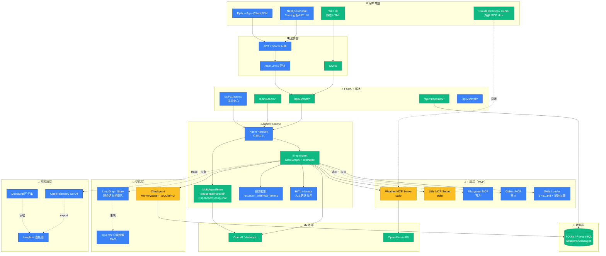
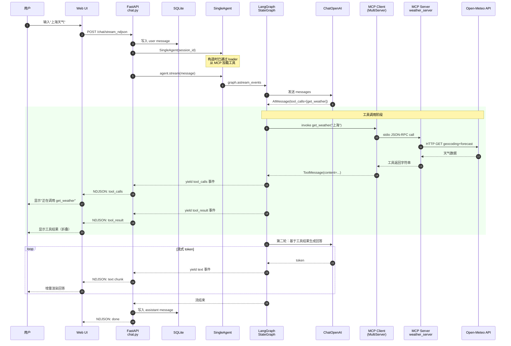
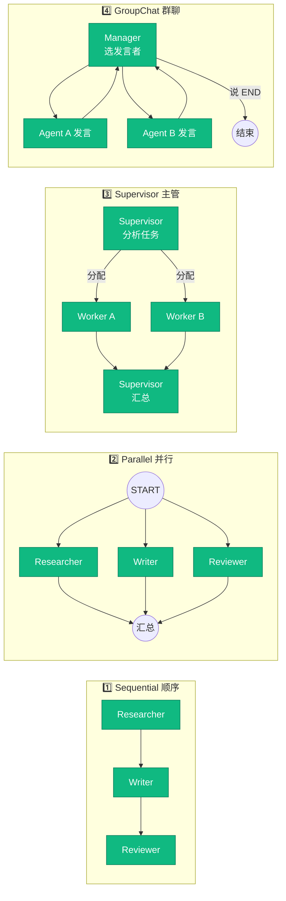
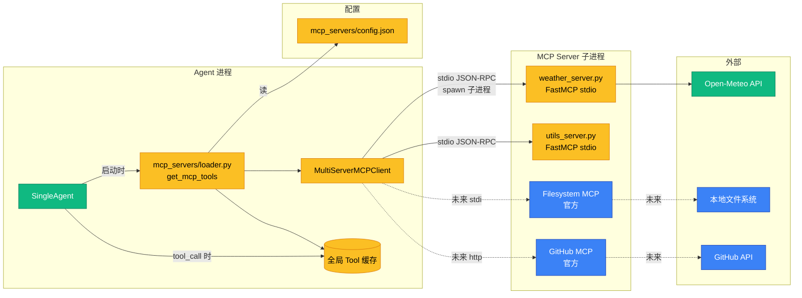
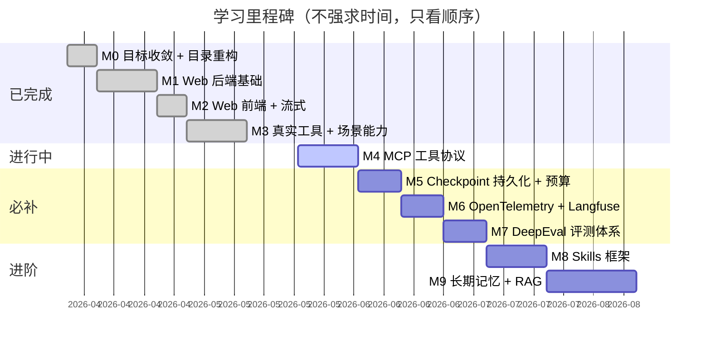
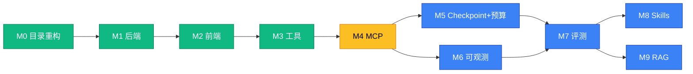
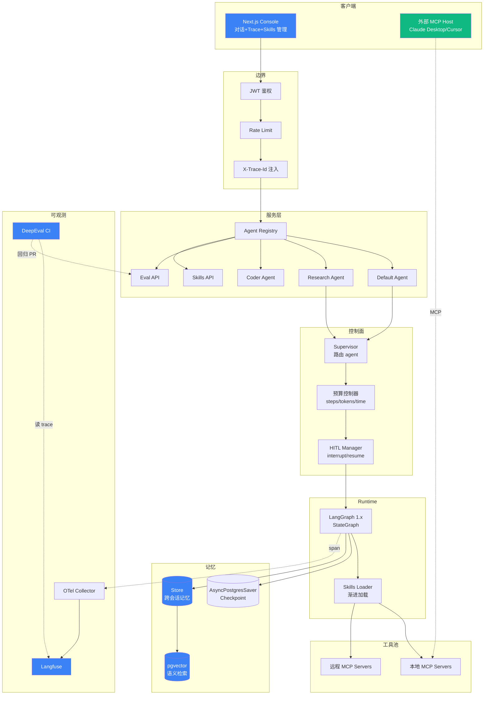

# 项目架构与流程图

> 6 张图覆盖项目"现状 + 未来"全貌。配色约定：
> - 🟢 **绿色 = 已完成**（M0-M4）
> - 🟡 **黄色 = 进行中**（当前里程碑）
> - 🔵 **蓝色 = 未来**（M5-M9）
> - ⚪ **灰色 = 不做**（已明确放弃）

> 所有图用 Mermaid 绘制，GitHub / VSCode 直接渲染。

---

## 📺 怎么看图（推荐顺序）

| 场景 | 用什么 |
|---|---|
| **看大图** ⭐ 推荐 | 浏览器打开 [diagrams.html](./diagrams.html) — 全屏 + 滚轮缩放 + 拖拽 + 一键导出 SVG/PNG |
| 快速浏览 | VSCode 打开本文件，按 `Cmd+Shift+V` 预览 |
| 临时看一张 | 复制 mermaid 代码到 [mermaid.live](https://mermaid.live) |
| GitHub 上看 | 直接打开本文件，GitHub 自动渲染（字稍小） |

**启动 diagrams.html：**

```bash
# 在项目根目录起一个本地静态服务（任选其一）
python3 -m http.server 9000
# 或 npx serve .

# 浏览器访问
open http://localhost:9000/docs/diagrams.html
```

---

## 1. 整体架构总览

把整个系统按"层"拆开看，每层标注"现在有什么 / 未来加什么"。



**怎么看这张图：**
- 绿色块都是你**今天已经能跑的**功能
- 黄色块是 **M4 这次刚加的**（MCP）
- 蓝色块是 **M5-M9 的目标**，按 LEARNING-PLAN.md 的优先级一个个填上去

---

## 2. 单 Agent 请求流程（含 MCP）

从用户在 Web UI 输入到看到流式输出的端到端数据流。



**关键学习点：**
- **第 7-8 步**是 MCP 改造前后最大的变化：以前 LangGraph 直接调本进程函数，现在通过 MCP Client 走子进程
- **第 16-19 步**是流式的本质：每个 token 一个事件，UI 增量渲染
- 整个流程的事件序列稳定（可作为回归测试基准）

---

## 3. Multi-Agent 4 种协作模式对比



**当前实现位置**：`apps/api/app/agents/multi/team.py`

**未来增强方向（M5 之后）**：
- 给每个 worker 加预算（max_steps）
- 用 LangGraph `Send` API 替换 `asyncio.gather`（更原生）
- 引入 `langgraph-supervisor` 库做层级 supervisor

---

## 4. MCP 集成架构（M4 重点）

放大看 MCP 这层的内部结构和数据流。



**这张图回答 3 个常见疑问：**

| 疑问 | 答案 |
|---|---|
| MCP Server 什么时候启动？ | Agent 第一次构造时（`get_mcp_tools()`），子进程随之 spawn |
| 工具调用走什么协议？ | stdio + JSON-RPC（每次调用复用同一个子进程） |
| 怎么加新工具？ | 写新 server 文件 → 改 `config.json` → 重启 API |

---

## 5. 学习里程碑路线图（M0-M9）



**依赖关系（哪个不做就阻塞下一个）：**



**关键依赖说明：**
- **M5 + M6 解锁 M7**：没有持久化和 trace，评测就无法回放和定位失败
- **M7 是分水岭**：完成后才能放心做 M8/M9，因为有了"防回退"的保护网

---

## 6. 未来形态：完整生产级架构（M9 完成时）

这是终态目标，所有里程碑做完后系统应该长这样：



**和现状对比，最显著的变化：**
1. **agent 不再单一** → 多个 agent 通过 Registry 管理，URL 路径选择
2. **工具池可远程** → 不再绑定本地子进程，可对接生态 MCP Server
3. **每次请求带 trace_id** → 任何失败都能在 Langfuse 复现现场
4. **CI 自动跑回归** → 改 prompt / 加工具不会偷偷退化

---

## 7. 怎么用这些图？

| 场景 | 看哪张图 |
|---|---|
| 给团队/朋友介绍项目 | 图 1（整体架构） |
| 调试一次请求出了什么问题 | 图 2（请求流程） |
| 决定新功能放哪 | 图 1 + 图 6 |
| 解释 MCP 怎么集成的 | 图 4 |
| 规划下一步学什么 | 图 5（路线图） |
| Code Review 时讲解改动 | 图 1（标出改动的色块） |

---

## 8. 维护建议

**图过期是常态，但要尽量准。** 每完成一个里程碑，按以下顺序更新：

1. **图 5 路线图** — 把当前 M 从 active 改成 done
2. **图 1 整体架构** — 把对应色块从蓝色改成绿色
3. **图 6 终态架构** — 这个不动，它代表目标
4. **新增专题图** — 类似图 4 这种"放大某个子系统"，每个新里程碑写一张

> 图越简单越好。如果一张图超过 30 个节点，就拆。

---

> 内容根据公开搜索结果做了改写以符合引用规范


---

## 9. Agent Harness 七层模型映射

> 参考 [AgentGuide](https://github.com/adongwanai/AgentGuide) 的 Harness Engineering 体系。
> "模型是大脑，Harness 是身体。Claude Code 90% 的代码是 Harness。"

本项目各层对应实现：

| 层 | 职责 | 本项目实现 | 文件 |
|---|---|---|---|
| **L1 模型层** | Provider 抽象 + 多模型切换 | ✅ ChatOpenAI + AVAILABLE_MODELS + UI 下拉 | `config.py` + `agent.py` |
| **L2 循环层** | Agent Loop / interrupt / resume | ✅ LangGraph StateGraph + tools_condition 循环 | `agent.py::_build_graph` |
| **L3 工具层** | Tools / Skills / MCP | ✅ MCP Servers（stdio+http）+ config 配置化 | `mcp_servers/` |
| **L4 记忆层** | Checkpoint / Vector Store | ✅ AsyncSqliteSaver（checkpoints.db）| `core/checkpointer.py` |
| **L5 人格层** | System Prompt / Policy | ✅ SystemMessage 在 stream() 里定义 | `agent.py::stream` |
| **L6 通道层** | CLI / Web / IM | ✅ Web UI（Vue 3 + NDJSON 流式）| `apps/web/src/`（构建产物 `dist/` 由 FastAPI 在 `/ui` 托管） |
| **L7 可靠性层** | Timeout / Retry / Cost Guard / Permission | ✅ recursion_limit + max_tokens + timeout + auth | `agent.py` + `core/auth.py` |

### 尚未实现（未来里程碑）

| 层 | 缺失能力 | 计划 |
|---|---|---|
| L4 | 向量检索（长期记忆） | M9 |
| L7 | OpenTelemetry trace | M6 |
| L7 | 评测回归 CI | M7 |
| L3 | Skills 渐进加载 | M8 |
